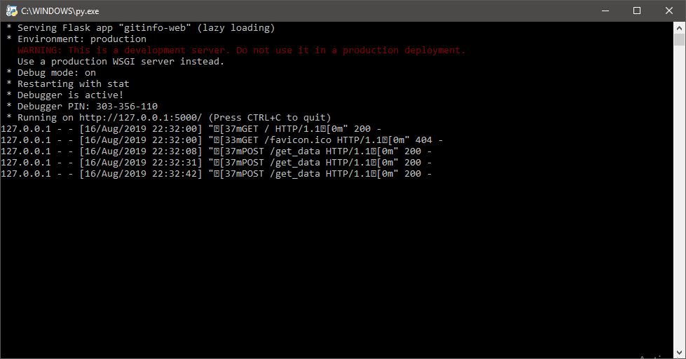
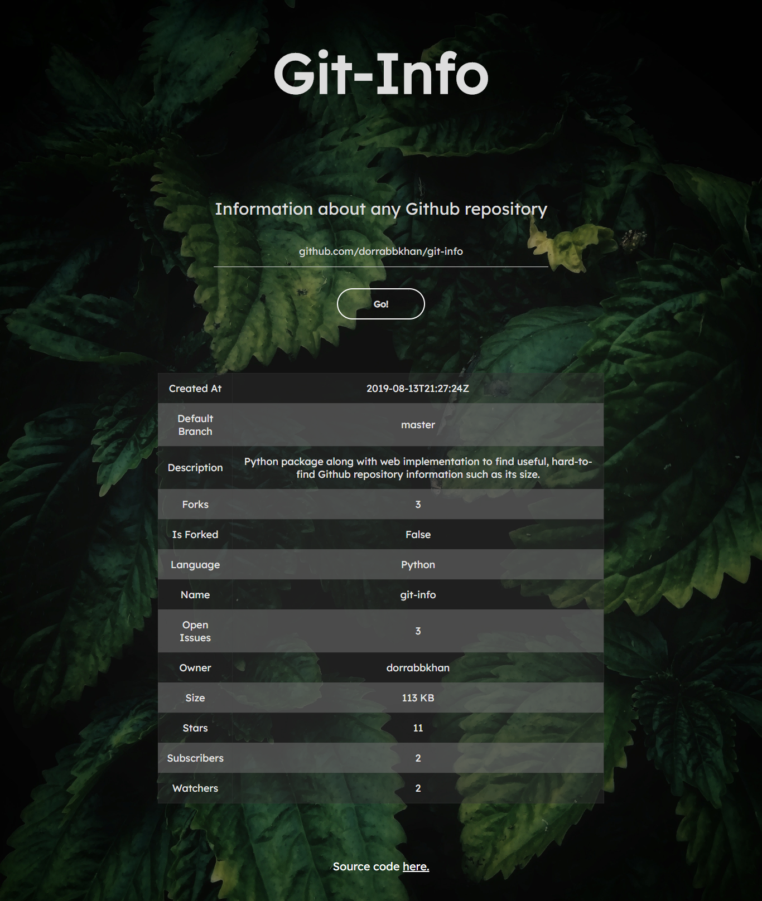

# Git-Info

 

Python package to view the size of a github repository, along with other useful information. This uses the requests and regex module to parse an input repository's URL, obtain the JSON for the respective repository using the Github API, parse the JSON, and return useful information about the Github repository. 


## How to run


If you haven't already, install the requests and the flask modules using:

```
pip install requests flask
```

or

```
pip install -r requrements.txt
```


Download gitinfo.py, and execute the file in Python. Input the Github repository's URL, and the repository's name, owner's name, description, whether it is forked or not, size, and programming language will be displayed. Running gitinfo-web.py will allow you to view this information in a web browser on your local network. Alternatively, import it into your own Python code using 

```
import gitinfo
```

## Example usage


When run as a script:

```
Enter a URL: github.com/dorrabbkhan/git-info

Name: git-info
Owner: dorrabbkhan
Description: Python script to view the size of a Github repository, along with other useful information.
Is Forked: True
Created At: 2019-08-13T21:27:24Z
Size: 0.01 MB
Language: Python
Watchers: 9
Stars: 9
Forks: 2
Open Issues: 5
Default Branch: master
Subscribers: 1
```

When importing into your own code:

```
from gitinfo import repository

new = repository("https://github.com/dorrabbkhan/GitSizeViewer")

print(f'\nName: {new.name()}')
print(f'Owner: {new.owner()}')
print(f'Description: {new.description()}')
print(f'Is Forked: {new.is_forked()}')
print(f'Created At: {new.created_at()}')
print(f'Size: {round(new.size()/1024, 3)} MB')
print(f'Language: {new.language()}')
print(f'Watchers: {new.watchers()}')
print(f'Stars: {new.stars()}')
print(f'Forks: {new.forks()}')
print(f'Open Issues: {new.open_issues()}')
print(f'Default Branch: {new.default_branch()}')
print(f'Subscribers: {new.subscribers()}')
```


When run in the web browser:






## Tests

Execute test.py to run tests on the package, implemented using unittest. All 21 tests should return OK, given that you have a working internet connection. 


## Future plans


- Add a GUI and functionality to run directly from CLI
- Add support for more types of repository URL's
- Publish package to PyPi
- Better documentation for usage
- Deploy on Heroku or similar web service

------


Feel free to suggest changes, and to fork! :)
